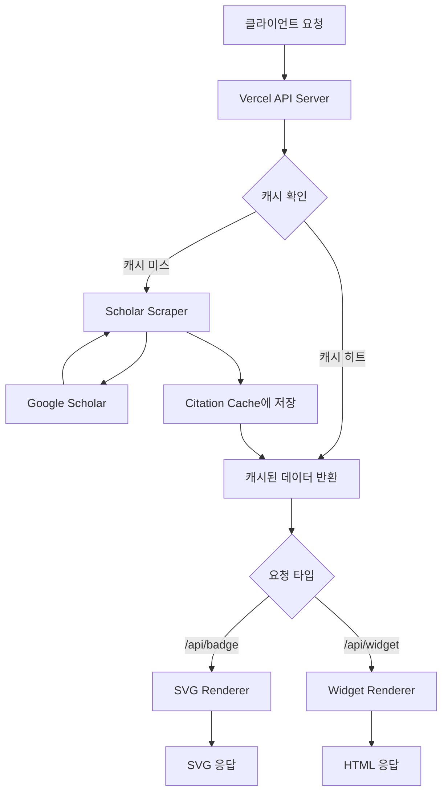
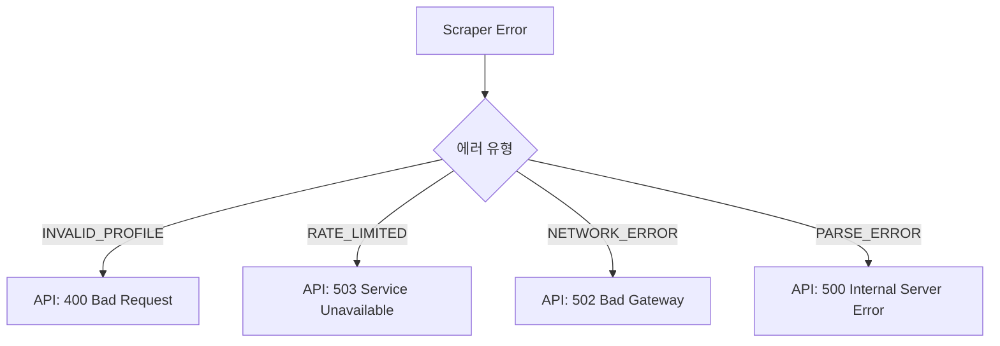

# 설계 문서: Scholar Citation Showcase

## 개요

Google Scholar 프로필에서 논문 인용 데이터를 스크래핑하여 SVG 배지와 HTML 위젯으로 렌더링하는 Vercel 서버리스 서비스이다. 핵심 흐름은 다음과 같다:

1. 클라이언트가 scholar_id와 함께 API 엔드포인트 요청
2. 캐시 확인 → 캐시 미스 시 Google Scholar 스크래핑
3. 논문 데이터를 인용 수 기준 정렬
4. 요청 형식(SVG 또는 HTML)에 맞게 렌더링하여 응답

## 아키텍처



### 기술 스택

- **프레임워크**: Next.js (App Router)
- **언어**: TypeScript
- **스크래핑**: cheerio (HTML 파싱)
- **캐싱**: in-memory Map + Next.js/Vercel Cache-Control 헤더 (CDN 캐싱)
- **배포**: Vercel (Next.js 네이티브 지원)
- **테스트**: vitest + fast-check

### 디렉토리 구조

```
/
├── app/
│   └── api/
│       ├── badge/
│       │   └── route.ts      # SVG 배지 엔드포인트 (GET)
│       └── widget/
│           └── route.ts      # HTML 위젯 엔드포인트 (GET)
├── lib/
│   ├── scraper.ts            # Google Scholar 스크래핑 로직
│   ├── cache.ts              # 캐싱 계층
│   ├── types.ts              # 공유 타입 정의
│   ├── svg-renderer.ts       # SVG 생성 로직
│   └── widget-renderer.ts    # HTML 위젯 생성 로직
├── __tests__/
│   ├── scraper.test.ts
│   ├── cache.test.ts
│   ├── svg-renderer.test.ts
│   ├── widget-renderer.test.ts
│   └── serialization.test.ts
├── package.json
├── tsconfig.json
└── next.config.ts
```

## 컴포넌트 및 인터페이스

### 1. Scholar Scraper (`lib/scraper.ts`)

Google Scholar 프로필 페이지를 가져와 HTML을 파싱하여 논문 데이터를 추출한다.

```typescript
interface ScraperResult {
  success: true;
  papers: Paper[];
}

interface ScraperError {
  success: false;
  error: string;
  errorType: 'INVALID_PROFILE' | 'RATE_LIMITED' | 'NETWORK_ERROR' | 'PARSE_ERROR';
}

type ScraperResponse = ScraperResult | ScraperError;

async function scrapeScholarProfile(scholarId: string): Promise<ScraperResponse>
```

**설계 결정**: Google Scholar에는 공식 API가 없으므로 HTML 스크래핑을 사용한다. cheerio를 선택한 이유는 서버리스 환경에서 가볍고 빠르기 때문이다. Puppeteer 같은 헤드리스 브라우저는 Vercel 서버리스 함수의 메모리/시간 제한에 적합하지 않다. Next.js의 내장 fetch를 활용하므로 node-fetch는 불필요하다.

**스크래핑 전략**:
- Google Scholar 프로필 URL: `https://scholar.google.com/citations?user={scholarId}&sortby=citedby`
- `sortby=citedby` 파라미터로 인용 수 기준 정렬된 페이지를 직접 요청
- cheerio로 `#gsc_a_b .gsc_a_tr` 테이블 행에서 논문 데이터 추출
- User-Agent 헤더를 설정하여 기본적인 차단 회피

### 2. Citation Cache (`lib/cache.ts`)

```typescript
interface CacheEntry {
  papers: Paper[];
  timestamp: number;
}

interface CacheConfig {
  ttlMs: number; // 기본값: 24 * 60 * 60 * 1000 (24시간)
}

class CitationCache {
  constructor(config?: Partial<CacheConfig>);
  get(scholarId: string): Promise<Paper[] | null>;
  set(scholarId: string, papers: Paper[]): Promise<void>;
  invalidate(scholarId: string): Promise<void>;
}
```

**설계 결정**: Vercel 서버리스 함수는 콜드 스타트 시 메모리가 초기화되므로, 단순 in-memory Map은 효과적이지 않다. 그러나 Vercel의 Edge Cache(Cache-Control 헤더)와 결합하면 대부분의 요청을 CDN 레벨에서 처리할 수 있다. 초기 구현은 in-memory Map + Cache-Control 헤더 조합으로 시작하고, 필요 시 Vercel KV로 업그레이드할 수 있도록 인터페이스를 설계한다.

### 3. SVG Renderer (`lib/svg-renderer.ts`)

```typescript
interface SVGRenderOptions {
  maxPapers: number;  // 기본값: 5
  theme?: 'light' | 'dark';
}

function renderSVG(papers: Paper[], options?: Partial<SVGRenderOptions>): string
```

**설계 결정**: SVG를 문자열 템플릿으로 직접 생성한다. 외부 SVG 라이브러리 없이 경량으로 구현하며, GitHub Markdown에서 렌더링 가능한 정적 SVG를 출력한다. GitHub는 SVG 내 `<foreignObject>`나 JavaScript를 허용하지 않으므로 순수 SVG 요소만 사용한다.

### 4. Widget Renderer (`lib/widget-renderer.ts`)

```typescript
interface WidgetRenderOptions {
  maxPapers: number;  // 기본값: 5
}

function renderWidget(papers: Paper[], options?: Partial<WidgetRenderOptions>): string
```

**설계 결정**: 자체 포함된(self-contained) HTML 페이지를 생성한다. 외부 CSS/JS 의존성 없이 인라인 스타일을 사용하여 iframe 임베드 시 격리된 환경에서도 올바르게 렌더링되도록 한다. `X-Frame-Options` 헤더를 설정하지 않아 iframe 임베드를 허용한다.

### 5. API Routes (`app/api/badge/route.ts`, `app/api/widget/route.ts`)

Next.js App Router의 Route Handlers를 사용한다.

```typescript
// app/api/badge/route.ts
import { NextRequest } from 'next/server';

export async function GET(request: NextRequest): Promise<Response>

// app/api/widget/route.ts
import { NextRequest } from 'next/server';

export async function GET(request: NextRequest): Promise<Response>
```

**설계 결정**: Next.js App Router의 Route Handlers를 사용하여 API 엔드포인트를 구현한다. `NextRequest`/`Response` Web API를 활용하며, Vercel에서 자동으로 서버리스 함수로 배포된다. 기존 Vercel Functions API(`VercelRequest`/`VercelResponse`) 대신 표준 Web API를 사용하여 이식성을 높인다.

## 데이터 모델

### Paper

```typescript
interface Paper {
  title: string;
  authors: string;
  citationCount: number;
  year: number | null;      // 출판 연도가 없을 수 있음
  scholarUrl: string;       // Google Scholar 논문 상세 페이지 링크
}
```

### CacheEntry

```typescript
interface CacheEntry {
  papers: Paper[];
  timestamp: number;        // 캐시 저장 시각 (Unix timestamp ms)
}
```

### JSON 직렬화 형식

Paper 객체는 다음 JSON 형식으로 직렬화/역직렬화된다:

```json
{
  "title": "논문 제목",
  "authors": "저자1, 저자2",
  "citationCount": 150,
  "year": 2023,
  "scholarUrl": "https://scholar.google.com/citations?view_op=view_citation&..."
}
```

`year` 필드가 `null`인 경우 JSON에서도 `null`로 직렬화되며, 역직렬화 시 `null`로 복원된다.


## 정확성 속성 (Correctness Properties)

*정확성 속성(property)이란 시스템의 모든 유효한 실행에서 참이어야 하는 특성 또는 동작이다. 사람이 읽을 수 있는 명세와 기계가 검증할 수 있는 정확성 보장 사이의 다리 역할을 한다.*

### Property 1: 스크래퍼 출력 정확성

*For any* HTML page that represents a valid Google Scholar profile, the Scholar_Scraper output SHALL be a list of Paper objects sorted by citationCount in descending order, where each Paper has a non-empty title, non-empty authors, a non-negative citationCount, and a non-empty scholarUrl.

**Validates: Requirements 1.1, 1.2**

### Property 2: 스크래퍼 견고성

*For any* arbitrary HTML string (including malformed, empty, or non-Scholar HTML), the Scholar_Scraper SHALL either return a valid ScraperResult or a ScraperError, and SHALL NOT throw an unhandled exception.

**Validates: Requirements 1.5**

### Property 3: 캐시 저장/조회 일관성

*For any* scholar_id and Paper list, storing the data in Citation_Cache and then immediately retrieving it (within TTL) SHALL return a Paper list equivalent to the original.

**Validates: Requirements 2.1**

### Property 4: 캐시 TTL 만료

*For any* cache entry and any TTL value, if the elapsed time since storage exceeds the TTL, the Citation_Cache SHALL return null for that entry.

**Validates: Requirements 2.3, 2.4**

### Property 5: SVG 렌더링 정확성

*For any* list of Paper objects and any count parameter, the SVG_Renderer SHALL produce output containing exactly min(count, papers.length) papers, and each rendered paper SHALL include the paper's title, citationCount, and publication year.

**Validates: Requirements 3.1, 3.2, 3.3**

### Property 6: SVG 구조적 유효성

*For any* list of Paper objects (including empty list), the SVG_Renderer SHALL produce output that is valid SVG markup starting with `<svg` and ending with `</svg>`, forming well-structured XML.

**Validates: Requirements 3.4**

### Property 7: 위젯 렌더링 정확성

*For any* list of Paper objects and any count parameter, the Widget_Renderer SHALL produce HTML output containing exactly min(count, papers.length) papers, and each rendered paper SHALL include the paper's title, authors, citationCount, year, and scholarUrl link.

**Validates: Requirements 4.1, 4.2, 4.4**

### Property 8: Paper 직렬화 라운드트립

*For any* valid Paper object, serializing to JSON and then deserializing back SHALL produce a Paper object equivalent to the original.

**Validates: Requirements 6.3**

## 에러 처리

### Scholar Scraper 에러

| 에러 유형 | 조건 | 응답 |
|-----------|------|------|
| `INVALID_PROFILE` | scholar_id에 해당하는 프로필이 없음 | ScraperError with descriptive message |
| `RATE_LIMITED` | Google Scholar가 CAPTCHA 또는 429 응답 반환 | ScraperError with retry suggestion |
| `NETWORK_ERROR` | 네트워크 연결 실패 또는 타임아웃 | ScraperError with network failure message |
| `PARSE_ERROR` | HTML 구조가 예상과 다름 | ScraperError with parse failure message |

### API Server 에러

| HTTP 상태 | 조건 | 응답 본문 |
|-----------|------|-----------|
| 400 | scholar_id 파라미터 누락 | `{ "error": "scholar_id parameter is required" }` |
| 500 | 스크래핑 또는 렌더링 중 내부 오류 | `{ "error": "Internal server error" }` (내부 상세 미노출) |

### 에러 전파 흐름



## 테스팅 전략

### 이중 테스팅 접근법

본 프로젝트는 단위 테스트와 속성 기반 테스트를 병행하여 포괄적인 검증을 수행한다.

### 속성 기반 테스트 (Property-Based Tests)

- **라이브러리**: [fast-check](https://github.com/dubzzz/fast-check) (TypeScript용 PBT 라이브러리)
- **최소 반복 횟수**: 각 속성 테스트당 100회 이상
- **태그 형식**: `Feature: scholar-citation-showcase, Property {N}: {property_text}`

각 정확성 속성은 하나의 속성 기반 테스트로 구현한다:

| 속성 | 테스트 파일 | 생성기 |
|------|------------|--------|
| Property 1: 스크래퍼 출력 정확성 | `__tests__/scraper.test.ts` | 유효한 Scholar HTML 페이지 생성기 |
| Property 2: 스크래퍼 견고성 | `__tests__/scraper.test.ts` | 임의의 HTML 문자열 생성기 |
| Property 3: 캐시 저장/조회 일관성 | `__tests__/cache.test.ts` | 임의의 scholar_id + Paper 배열 생성기 |
| Property 4: 캐시 TTL 만료 | `__tests__/cache.test.ts` | 임의의 TTL 값 + 타임스탬프 생성기 |
| Property 5: SVG 렌더링 정확성 | `__tests__/svg-renderer.test.ts` | 임의의 Paper 배열 + count 생성기 |
| Property 6: SVG 구조적 유효성 | `__tests__/svg-renderer.test.ts` | 임의의 Paper 배열 생성기 (빈 배열 포함) |
| Property 7: 위젯 렌더링 정확성 | `__tests__/widget-renderer.test.ts` | 임의의 Paper 배열 + count 생성기 |
| Property 8: Paper 직렬화 라운드트립 | `__tests__/serialization.test.ts` | 임의의 Paper 객체 생성기 |

### 단위 테스트 (Unit Tests)

단위 테스트는 구체적인 예시, 엣지 케이스, 에러 조건에 집중한다:

- **스크래퍼**: 유효하지 않은 scholar_id, CAPTCHA 응답, 빈 프로필 등 에러 케이스
- **캐시**: 캐시 미스 시 스크래핑 트리거, 기본 TTL 값 확인
- **SVG 렌더러**: count가 논문 수 초과 시 동작, 빈 목록 렌더링
- **위젯 렌더러**: iframe 임베드 호환성, 빈 목록 렌더링
- **API 엔드포인트**: 400/500 응답, Content-Type 헤더, Cache-Control 헤더

### 테스트 실행

```bash
# 전체 테스트 실행
npx vitest --run

# 특정 테스트 파일 실행
npx vitest --run __tests__/scraper.test.ts
```

테스트 프레임워크로 vitest를 사용하며, fast-check과 통합하여 속성 기반 테스트를 실행한다.
